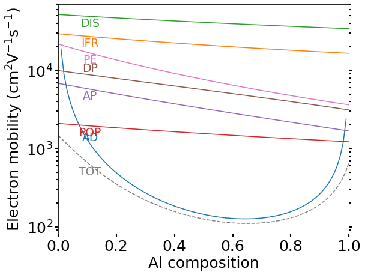
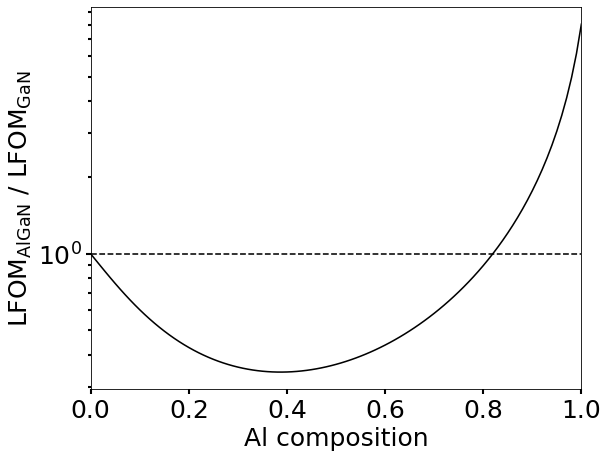
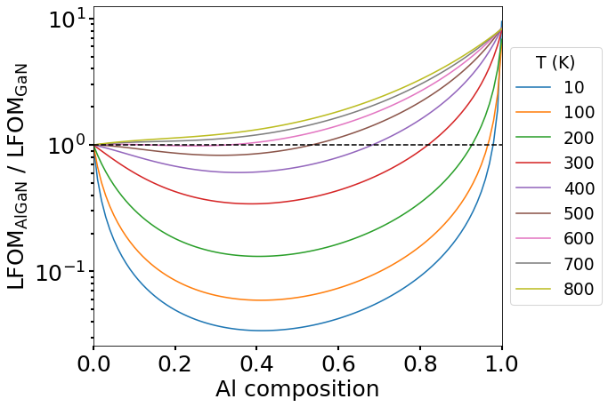

# `mobilitypy`: Python package for mobility calculations in semiconductor heterostructures

<!-- =========================================================== -->

<!-- =========================================================== -->
 |  |  
:------------------------------:| :------------------------------:| :------------------------------:
AlN/AlGaN HEMT 2DEG mobilities | AlN/AlGaN HEMT lateral figure of merit | AlN/AlGaN HEMT lateral figure of merit (Temperature effect) 
<!-- =========================================================== -->

<!-- =========================================================== -->
## Systems
<!-- =========================================================== -->
### 1. High electron mobility transistors (HEMTs)

<!-- =========================================================== -->
## Developers and contributors
<!-- =========================================================== -->

__Developer of mobilitypy :__
[Badal Mondal](https://github.com/bmondal94) 

__Maintainer of mobilitypy :__
[Badal Mondal](https://github.com/bmondal94)

__mobilitypy Contributors:__  [Contributors](https://github.com/SemiconductorTransport/mobilitypy/graphs/contributors)

* We sincerely thank each and every contributors for their valuable input and support.

__Contact us:__ [Email developer/maintainer team](mailto:badalmondal.chembgc@gmail.com)

* If you would like to contribute to the development of `mobilitypy` or request new functionality, please get in touch with [us](mailto:badalmondal.chembgc@gmail.com) or open a pull request. We appreciate and respect our users' views and are committed to providing the best experience possible. Your feedback is highly valued. We will be happy to support your request ASAP.

<!-- =========================================================== -->

<!-- =========================================================== -->
## Installation

### 1. Requirements
```
    1. python>=3.12
    2. numpy
    3. scipy
    4. matplotlib
    5. pathlib
    6. pandas
```

### 2. Installation using `pip` [not available yet]

```
    TBA
```

### 3. Installation from github repository

```
    git clone https://github.com/SemiconductorTransport/mobilitypy.git
    cd mobilitypy
    pip install .  
```
Or, without cloning
```
    pip install git+https://github.com/SemiconductorTransport/mobilitypy.git@specific_branch
```

<!-- =========================================================== -->


<!-- =========================================================== -->
## Usage
__Documentation__: [here](docs/USAGE.md)
__Material database__: [here](mobilitypy/src/database.py)

The detailed documentation is available [here](docs/USAGE.md). Explore the [tutorial](tutorials) folder for example tutorials. Below are quick snippets showcasing what you can achieve with `mobilitypy`:
```
mobilitypy package:
    1. AlloyParams class
        1.1 get_alloy_params()
    2. Mobility2DCarrier class
        2.1 calculate_sheet_mobility()
        2.2 sc_rate_2_mobility()
        2.3 calculate_sheet_resitance()
        2.4 calculate_figure_of_merit()
    3. Plottings class
        3.1 plot_2d_carrier_mobilities()
        3.2 plot_2d()
        3.3 save_figure()
    4. PlotQuasi3DFuns class
        4.1 InterPolation()
        4.2 Plotq3D()
```

<!-- =========================================================== -->
## Tips and tricks:

__FAQs__: [here](docs/FAQs.md)

You can find a list of common user issues encountered while using this software [here](docs/FAQs.md). We appreciate and respect our users' views and are committed to providing the best experience possible. Your feedback is highly valued.

<!-- =========================================================== -->

<!-- =========================================================== -->
## Citations and references:

If you use `mobilitypy` in your work, please:

  * **State EXPLICITLY that you have used the mobilitypy code** (or a modified version of it, if this is the case), for instance, adding a sentence like:

         "The mobility calculation has been performed using the mobilitypy code"

  * **Read and cite the following papers** (and the appropriate references therein):

        *  The analytical mobility models are implemented based on the following publications:
>> 1. J. Bassaler, J. Mehta, I. Abid, L. Konczewicz, S. Juillaguet, S. Contreras, S. Rennesson, S. Tamariz, M. Nemoz, F. Semond, J. Pernot, F. Medjdoub, Y. Cordier, P. Ferrandis, Al-Rich AlGaN Channel High Electron Mobility Transistors on Silicon: A Relevant Approach for High Temperature Stability of Electron Mobility. [Adv. Electron. Mater. 2024, 2400069.](https://doi.org/10.1002/aelm.202400069)
>> 2. J. Zhang, Y. Hao, J. Zhang, J. Ni, The mobility of two-dimensional electron gas in AlGaN/GaN heterostructures with varied Al content. [Sci. China Ser. F-Inf. Sci. 51, 780–789 (2008).](https://doi.org/10.1007/s11432-008-0056-7)
>> 3. B. Mondal, P. Pampili, J. Mukherjee, D. Moran, P.J. Parbrook, S. Schulz, Interplay of carrier density and mobility in Al-rich (Al,Ga)N-channel HEMTs: Impact on high-power device performance potential. [preprint arXiv:2502.13809](https://doi.org/10.48550/arXiv.2502.13809)

__2DEG mobility analytical models:__ [Mobility2DEGAnalyticalModels.pdf](docs/Mobility2DEGAnalyticalModels.pdf)

__Bibliography file:__ Here is the [bibliography file](docs/REFERENCES.md) for your convenience.

<!-- =========================================================== -->

<!-- =========================================================== -->
## Version release
__Latest release: v1.0.0__

Chekout out [version release history here](docs/RELEASE.md) for the full list of updates and upgrades.

<!-- =========================================================== -->

<!-- =========================================================== -->
## License
* [GNU General Public License v3.0](LICENSE)
<!-- =========================================================== -->

<!-- =========================================================== -->
## Upcoming (TBD)
1. TBA
<!-- =========================================================== -->

